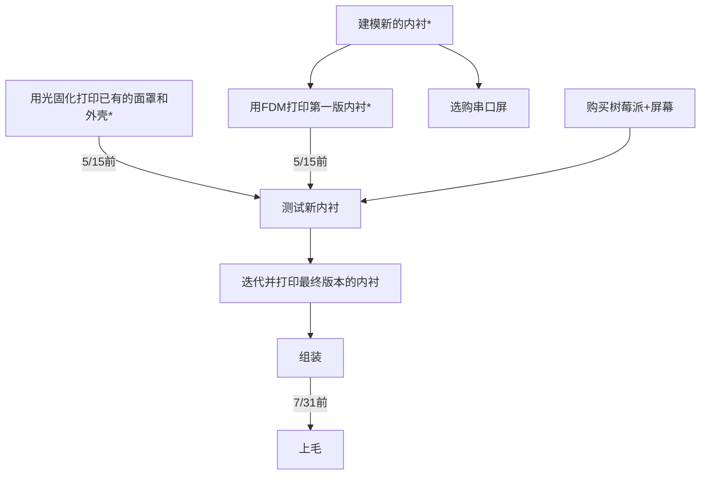

# string-protogen

这是用于重置Protogen "String"的仓库. 

## Timeline

(标*的为雪风侧的事项)

```mermaid
graph TB

	用光固化打印已有的面罩和外壳* -->|5/15前| 测试新内衬
	建模新的内衬* --> 用FDM打印第一版内衬*
	用FDM打印第一版内衬* -->|5/15前| 测试新内衬
	建模新的内衬* --> 选购串口屏
	购买树莓派+屏幕 --> 测试新内衬
	测试新内衬 --> 迭代并打印最终版本的内衬
	迭代并打印最终版本的内衬 --> 组装
	组装 --> |7/31前| 上毛
	

```

